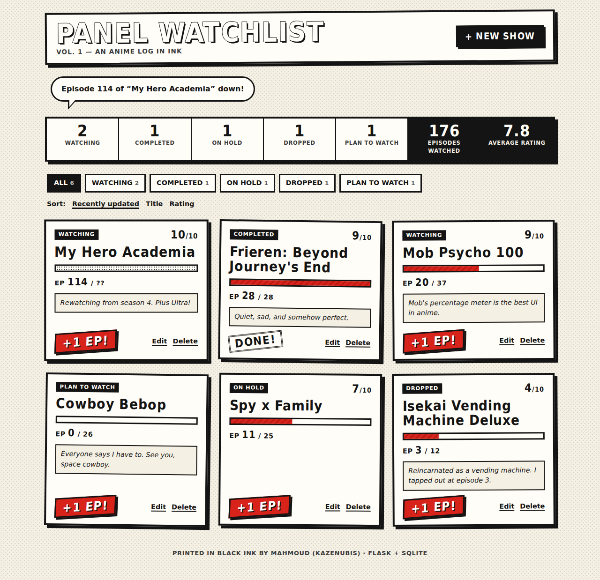

# Panel Watchlist

A small Flask app for tracking the anime you're watching, styled like a printed manga page instead of yet another dark dashboard.



## Why I built this

I watch a lot of anime (My Hero Academia is the one I keep coming back to) and I wanted one place to see where I stopped in each show. I also got feedback that all my Flask projects looked like the same dark template, so this time I made the look part of the project: paper, screentone dots, thick ink borders, and speech bubbles for messages.

## Features

- Add, edit and delete shows (title, episodes watched, total episodes, status, rating 1-10, notes)
- A red "+1 EP!" button that stops at the last episode and marks the show completed when you reach it
- Leave total episodes blank for shows that are still airing
- Filter tabs for Watching / Completed / On hold / Dropped / Plan to watch
- Sort by recently updated, title or rating
- Stats strip: shows per status, total episodes watched, average rating
- Server-side validation with friendly speech-bubble messages
- Every change goes through POST; deleting asks for confirmation first
- No JavaScript at all: just Jinja templates and one `static/style.css`
- Works on phone screens and respects `prefers-reduced-motion`

## Run it

```bash
python -m venv .venv
.venv\Scripts\activate
pip install -r requirements.txt
```

Add some sample shows (optional; running it again won't add duplicates):

```bash
flask --app panel_watchlist seed
```

```text
Seeded 6 sample show(s). 0 were already there.
```

Start the app:

```bash
flask --app panel_watchlist run
```

```text
 * Serving Flask app 'panel_watchlist'
 * Debug mode: off
WARNING: This is a development server. Do not use it in a production deployment. Use a production WSGI server instead.
 * Running on http://127.0.0.1:5000
Press CTRL+C to quit
```

Then open http://127.0.0.1:5000. You'll see a cream page with a halftone dot pattern, a "PANEL WATCHLIST" masthead, a black-bordered stats strip, and each show as a slightly tilted manga panel with a red progress bar and a "+1 EP!" button. Finished shows get a "DONE!" stamp instead. Click "+1 EP!" and the confirmation shows up as a speech bubble.

The database is a SQLite file at `instance/panel_watchlist.sqlite3`, created the first time the app starts. Titles use the Bangers font from Google Fonts. If you're offline, the page falls back to a heavy system font (Impact on Windows), which is what the screenshot above shows.

## Run the tests

```bash
python -m pytest -q
```

## Project structure

```text
panel-watchlist/
├── panel_watchlist/
│   ├── __init__.py        # create_app() factory + `seed` CLI command
│   ├── db.py              # sqlite3 connection per request, schema
│   ├── shows.py           # validation, queries, +1 logic, stats (no Flask)
│   ├── views.py           # routes (all changes are POST)
│   ├── static/style.css   # the whole manga look
│   └── templates/         # base, index, form, confirm_delete
├── tests/
│   ├── conftest.py        # app on a temporary database
│   └── test_watchlist.py
├── docs/screenshot.png
├── pytest.ini
└── requirements.txt
```

## What I practiced

- The Flask app factory pattern (`create_app(config)`) so tests run against a throwaway SQLite file
- Plain `sqlite3` with a small data-access module and whitelisted `ORDER BY` options instead of an ORM
- Keeping validation and business rules (episode cap, auto-complete) in pure functions that are easy to unit test
- POST-only changes, a delete confirmation page, and a safe `next` redirect that only allows paths on this site
- CSS-only design: `radial-gradient` screentone, pseudo-element speech-bubble tails, alternating `rotate()` panels and `prefers-reduced-motion`
